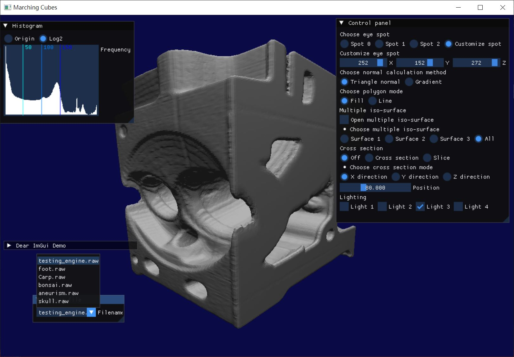

# Scientific-Visualization

This repository is for saving my Scientific Visualization homework. Homework report:

hw1: iso-surface
[report.pdf](https://github.com/user-attachments/files/21209972/report.pdf)

 

 
  

hw2: ray-casting
[report.pdf](https://github.com/user-attachments/files/21209974/report.pdf)

 
  

hw3: Line Integral Convolution
[report.pdf](https://github.com/user-attachments/files/21209991/report.pdf)

   
   
   
   

hw4: SammonMapping
[report.pdf](https://github.com/user-attachments/files/21209998/report.pdf)

hw5: SOM
[report.pdf](https://github.com/user-attachments/files/21210002/report.pdf)

